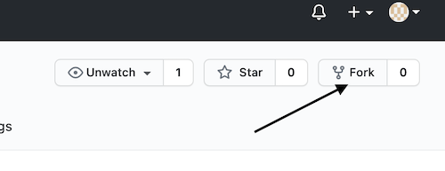

# Noughts & Swords

This was a joint project between [nolixul](https://github.com/nolixul) and [paulor26](https://github.com/PaulOR26) to build a mini app using React.

There were two main purposes of creating the app. Firstly to develop our approaches to planning an app build, and secondly to consolidate our learning of the react framework. Through React we were able to utilise components and hooks to implement a simple idea that has the potential to be scaled up.

[Click here to view and play the hosted game.](https://noughts-and-swords.netlify.app)

## Our planning consisted of:

- Outlining the basic functionality and sketching the UI.
- Breaking it up into components and drawing out the component hierarchy.
- Deciding on what data the app will need to hold in state, and for each piece of state, which components will need access to read or update it.
- Placing the state high enough on the component tree for required components to have access, whilst remaining as low as possible.

## Setup

- **Fork** this repo  
  

- **Clone** to your local machine  
  `git clone https://github.com/PaulOR26/noughts-and-swords.git`

- **Install** dependencies  
  `npm install`

- **Deploy** website  
  `npm start`

## Requirements

- **Node.js** v16.3.0
